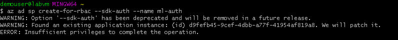
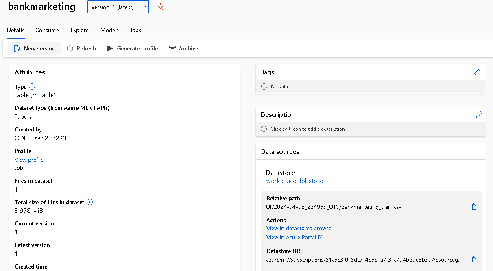
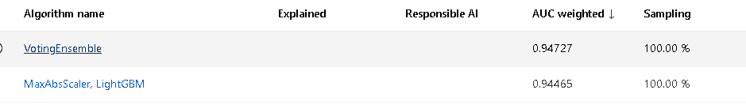
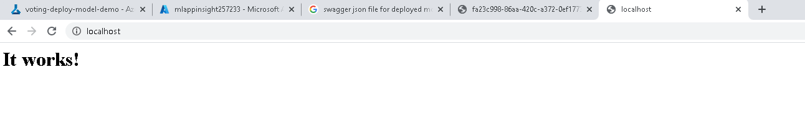
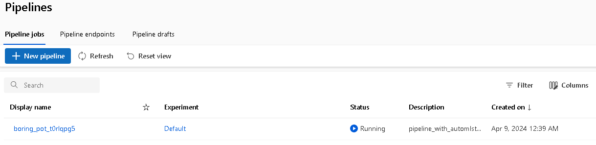
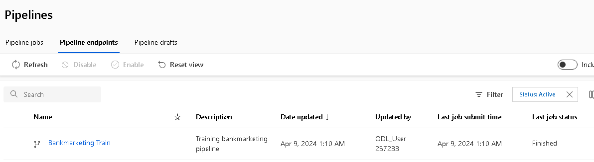

*NOTE:* This file is a template that you can use to create the README for your project. The *TODO* comments below will highlight the information you should be sure to include.

# Bankmarketing Classification Project
We want to implement a pipeline, that enables us to deliver a network that is able to classify people based on different features. The pipeline includes an automated ML Experiment, based on which we deploy a model. We then enable Logging using swagger and Azure Endpoints. 

## Architectural Diagram

*TODO*: Provide an architectual diagram of the project and give an introduction of each step. An architectural diagram is an image that helps visualize the flow of operations from start to finish. In this case, it has to be related to the completed project, with its various stages that are critical to the overall flow. For example, one stage for managing models could be "using Automated ML to determine the best model". 

## Key Steps
*TODO*: Write a short discription of the key steps. Remeber to include all the screenshots required to demonstrate key steps. 

### Authentication

As we use the VM supplied by Udacity we lack permission to create the Service Principal.
### Automated ML Experiment

We include the Dataset in our Azure Workspace.
After this step is completed we setup and run our ML Experiment.

Finally we choose the best Model from the experiment.

### Deploying the model
We choose the best model as stated in the previous chapter, and deploy this model with Authentication using Azure Container Instance.
### Logging
We then enable Application Insight.

We then adapt the logs.py script to fit our model and deployment.
### Swagger
We adapt swagger.sh and serve.py to fit our pipeline. 

### Model Endpoint
The endpoint is used and works for an example dataset.

### Pipeline 
The pipeline was implemented using the provided iPython Notebook.

## Future Improvement
Possible Future Improvemnts would be to extend the Logging or Swagger Functions building on the Endpoint to improve and extend the consumption.
